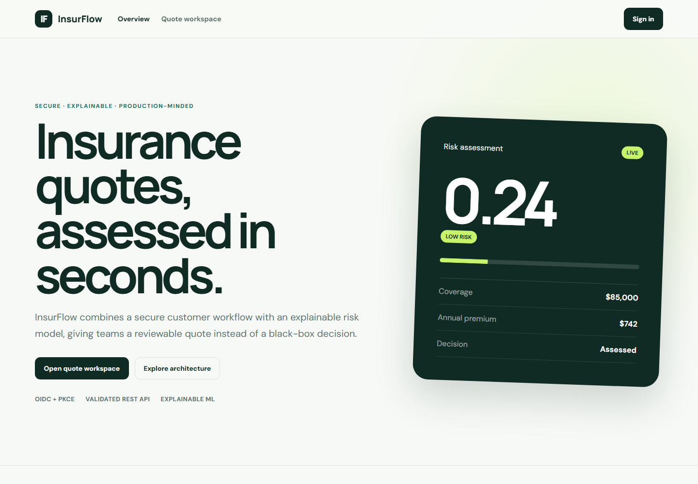
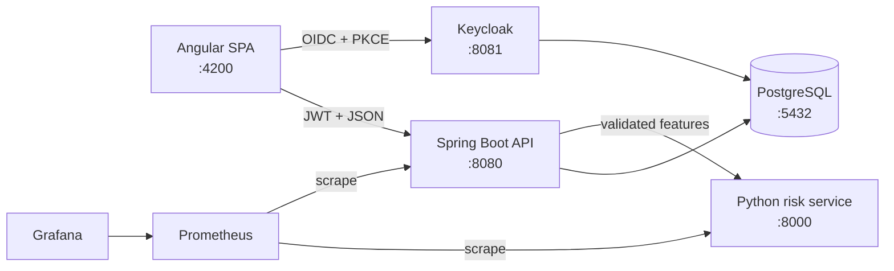

# InsurFlow

Secure, explainable insurance quote platform built as a production-minded portfolio project.

InsurFlow turns customer and coverage inputs into a persisted, reviewable quote. An Angular client authenticates through Keycloak, a Spring Boot API validates and orchestrates the workflow, and a Python service produces an explainable risk score and premium recommendation.



> **Portfolio disclaimer:** This project uses synthetic training data and is not intended for real underwriting, financial advice, or processing personal customer data.

## Why this project exists

This repository is a focused rebuild of the insurance quotation contribution I developed within a team academic microservices project. The rebuild isolates my quotation domain work, removes unrelated team modules and unsafe credentials, replaces data of unclear provenance with deterministic synthetic training data, and adds the engineering work expected from a public portfolio repository.

## Highlights

- OAuth 2.0 / OpenID Connect login with Keycloak and PKCE
- Role-protected Spring Boot REST API with Bean Validation
- PostgreSQL persistence with versioned Flyway migrations
- Python risk service with reproducible model training and explanations
- Graceful degradation: quotes remain reviewable if ML is unavailable
- Responsive Angular interface with typed forms and token-aware requests
- Docker Compose environment with health-aware startup ordering
- Prometheus metrics with an automatically provisioned Grafana dashboard
- Kubernetes deployment with probes, resource controls, autoscaling, and disruption budgets
- Versioned container images published to GitHub Container Registry
- OpenAPI/Swagger documentation and automated test suites
- GitHub Actions CI and Dependabot configuration
- No committed secrets, personal datasets, generated databases, or model binaries

## Architecture



See [the architecture guide](docs/architecture.md) for the request sequence, boundaries, failure behavior, and security model.

## Technology stack

| Layer | Technologies |
| --- | --- |
| Web | Angular 22, TypeScript, SCSS, RxJS, Keycloak JS |
| API | Java 17, Spring Boot, Spring Security, Spring Data JPA, Flyway, springdoc-openapi |
| ML | Python 3.12, FastAPI, scikit-learn, NumPy, Pydantic |
| Platform | PostgreSQL, Keycloak, Docker Compose, Kubernetes, Kustomize, Nginx |
| Observability | Prometheus, Micrometer, Grafana, provisioned dashboards |
| Quality | JUnit 5, Mockito, Vitest, Pytest, GitHub Actions, Dependabot |

## Quick start

### Requirements

- Docker Desktop with Docker Compose v2
- Approximately 4 GB of free memory for the full stack

### Run everything

```bash
git clone https://github.com/MontassarBenMesmia/insurflow-platform.git
cd insurflow-platform
cp .env.example .env
docker compose up --build
```

On Windows PowerShell, you can run:

```powershell
.\scripts\dev.ps1
```

The first build downloads the Java, Node, Python, Keycloak, and PostgreSQL dependencies and may take several minutes.

To include the monitoring stack:

```bash
docker compose --profile observability up --build
```

### Local endpoints

| Service | URL |
| --- | --- |
| Web application | http://localhost:4200 |
| Swagger UI | http://localhost:8080/swagger-ui.html |
| API health | http://localhost:8080/actuator/health |
| ML documentation | http://localhost:8000/docs |
| ML health | http://localhost:8000/health |
| Keycloak administration | http://localhost:8081 |
| Prometheus (observability profile) | http://localhost:9090 |
| Grafana (observability profile) | http://localhost:3000 |

### Demo login

- Username: `demo`
- Password: `demo123`

These credentials are imported only for local demonstration. The Keycloak administrator credentials come from `.env`; replace every default before deploying anywhere outside your machine.

## API example

Protected API calls require an access token issued to the `insurflow-web` client.

```http
POST /api/quotes
Authorization: Bearer <access-token>
Content-Type: application/json

{
  "customerName": "Demo Customer",
  "age": 34,
  "annualIncome": 62000,
  "coverageAmount": 85000,
  "previousClaims": 1,
  "vehicleAge": 5,
  "quoteType": "AUTO"
}
```

Example response:

```json
{
  "id": "e7bf2628-a4d3-4a71-a4f7-c75d89519ce1",
  "status": "ASSESSED",
  "riskScore": 0.2841,
  "riskBand": "LOW",
  "recommendedPremium": 789.24,
  "createdBy": "demo"
}
```

## Run tests locally

### Backend

```bash
cd backend
mvn test
```

### Frontend

```bash
cd frontend
npm ci
npm test -- --watch=false
npm run build
```

### ML service

```bash
cd ml-service
python -m venv .venv
# Windows: .venv\Scripts\activate
# Linux/macOS: source .venv/bin/activate
python -m pip install -r requirements-dev.txt
pytest
```

## Kubernetes deployment

Production-style Kustomize resources cover the complete platform, health probes, resource requests and limits, Horizontal Pod Autoscalers, Pod Disruption Budgets, ingress routing, Prometheus, and Grafana. Secrets are deliberately excluded from the rendered configuration.

See the [operations guide](docs/operations.md) for the deployment contract, local-cluster commands, observability workflow, and production adaptations.

## Repository structure

```text
insurflow-platform/
├── backend/                 Spring Boot quote API
├── frontend/                Angular web application
├── ml-service/              FastAPI risk scoring service
├── infra/
│   ├── keycloak/            Importable realm, client, roles, and demo user
│   ├── kubernetes/           Workloads, ingress, probes, scaling, and resilience
│   ├── observability/        Prometheus and provisioned Grafana dashboard
│   └── postgres/             Local initialization scripts
├── docs/                    Architecture documentation
├── scripts/                 Developer utilities
├── .github/                 CI and dependency automation
└── docker-compose.yml       Complete local platform
```

## Engineering decisions

- **One domain API instead of unnecessary service discovery:** Eureka and a config server were removed because a two-service portfolio system does not benefit from their operational cost.
- **Synthetic data by construction:** the training script generates deterministic records, avoiding personal information and ambiguous dataset licensing.
- **Generated model artifact:** the binary model is built from source and excluded from Git, keeping the repository auditable and lightweight.
- **External identity provider:** credentials and roles stay out of application code; the SPA uses the recommended browser PKCE flow.
- **Pending-review fallback:** a temporary ML outage does not discard a valid quote request.
- **One image, two operating targets:** Compose and Kubernetes run the same container builds and metric contracts.
- **Observable by default:** both APIs expose Prometheus metrics, while the dashboard is provisioned from version-controlled JSON.

## Security

Do not submit real customer information. Review [SECURITY.md](SECURITY.md) before adapting the project, and never reuse the included local demo credentials.

## Author and project history

Developed and maintained by [Montassar Ben Mesmia](https://github.com/MontassarBenMesmia).

The original academic platform was collaborative. This public repository is a standalone rewrite centered on my insurance quotation contribution and documents that origin explicitly; it does not claim sole authorship of the former team application.

## License

Released under the [MIT License](LICENSE).
