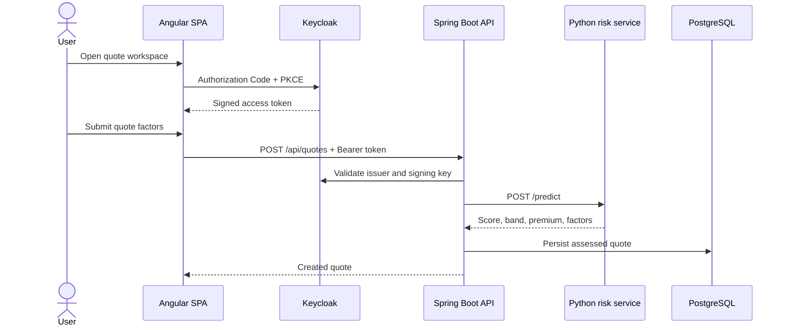

# Architecture

## Runtime flow

## Boundaries

| Component | Responsibility | Failure behavior |
| --- | --- | --- |
| Angular SPA | Authenticated workflow and presentation | Shows an actionable service error |
| Keycloak | Identity, PKCE login, realm roles | Protected operations remain unavailable |
| Spring Boot API | Validation, authorization, orchestration, persistence | Persists a pending-review quote if ML is unavailable |
| Python risk service | Model training, prediction, explanation | Health endpoint reports model availability |
| PostgreSQL | Durable quote and identity data | Containers wait for database readiness |

## ML design

The demo model is trained from deterministic synthetic data during the image build. This avoids redistributing personal or third-party insurance data. The model is intentionally educational: its output must not be used for real underwriting decisions. The response includes a bounded probability, a risk band, a recommended premium, and the three strongest model factors.

## Security model

- Public client: `insurflow-web`
- Flow: Authorization Code with PKCE (`S256`)
- Realm roles: `customer`, `admin`
- API: stateless OAuth 2.0 resource server
- CORS: restricted to the configured frontend origin
- Secrets: environment-only; local demo values are explicitly non-production
